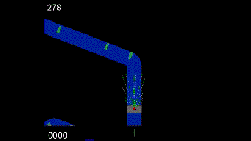

# :red_car: Printemps des Sciences 2021 : GreenML

Ce projet à été réalisé dans le cadre du Printemps des Sciences, un événement organisé par l'Université libre de Bruxelles (ULB) pour promouvoir les sciences auprès des plus jeunes. Notre but est de présenter le machine learning ainsi que l'impact environnemental qu'a le machine learning sur l'environnement. Pour ce faire, nous avons décidé avec notre promotteur Jacopo DE STEFANI (ULB Machine learning group), de présenter des modèles de voitures autonomes sous l'environnement car_racing de openAI.

## :question: Qu'est-ce que notre approche apporte ? 

- En plus de simplement apprendre à conduire sur un circuit, nous apportons un point qui n'a pas encore été étudié sur cet environnement à notre connaissance : la capacité à esquiver des **obstacles**. 
- Des informations sur les consommations énergétiques de nos modèles grâce à la librairie *carbonTracker*.
- Une implémentation de capteurs de distance parcourable sous l'environnement car_racing : nous les appelerons les *sensors*.


	<div align=center><Image src="Image/capteur.png" width="35%"/></div>


## :question: Mais comment ?

- A l'aide d'un modèle d'apprentissage par renforcement : le modèle Actor Critic (A2C). Le modèle prend cette fois-ci ses décisions à partir de l'état composé de :
	- La vitesse de la voiture
	- Les distances déterminées par nos 13 sensors


## :exclamation: Testez chez vous !

### Packages à installer

Pour faire tourner les différents modèles vous aurez besoin de ces modules, tous instalables via le gestionnaire de paquets *pip*. 
- numpy
- matplotlib
- torch
- torchvision
- imageio
- pyglet
- gym
- Box2D
- carbontracker (vous aurez peut-être besoin de : ```sudo chmod a+r /sys/class/powercap/intel-rapl:0/energy_uj```)

### Actor Critic

Vous pouvez lancer l'entraînement et son affichage graphique grâce à : <br>
```python3 RL/train_A2C_v2.py```


## :checkered_flag: Performance

### Actor Critic
```
CarbonTracker: The following components were found: GPU with device(s) GeForce GTX 1070.
CarbonTracker: Average carbon intensity during training was 294.21 gCO2/kWh at detected location: Brussels, Brussels Capital, BE.
CarbonTracker: 
Actual consumption for 2000 epoch(s):
	Time:	10:01:48
	Energy:	0.634464 kWh
	CO2eq:	186.663184 g
	This is equivalent to: 1.550359 km travelled by car
```
<div align=center><Image src="Results/A2C_2000epochs.png" width="50%"/></div> <!-- Le center align ne marche pas Sadge -->
<div align=center></div>


## :bulb: Légende de l'interface utilisateur
<div align=center><Image src="Image/UI_legend.png" width="50%"/></div>

